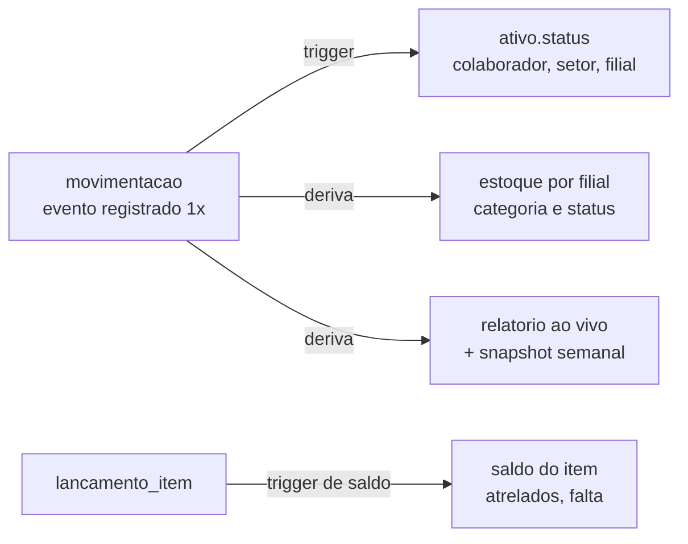

# Arquitetura — Estoque TI WAP

Como o sistema está construído hoje e **onde mora cada regra** — o ponto de partida para quem chega ao código. Este documento **não duplica** a especificação: o *o quê* está em [`ESPECIFICACAO.md`](ESPECIFICACAO.md), o *como/quando* em [`PLANEJAMENTO.md`](PLANEJAMENTO.md) e o histórico em [`../CHANGELOG.md`](../CHANGELOG.md). Aqui está o *como está montado*.

## 1. Conceito central: a movimentação é a fonte da verdade

Registra-se **um evento** — a movimentação (saída, devolução, compra, transferência, ajuste…). O resto é **derivado por trigger no Postgres**, nunca digitado duas vezes:



Consequências que orientam todo o resto:

- **A UI é a segunda linha, nunca a única.** As regras críticas (máquina de estados, saldos de itens, permissões) vivem no banco (triggers/RPCs). Se a interface tiver bug, o dado não corrompe.
- **Histórico é imutável.** Uma movimentação não se apaga — **estorna-se** (tipo `estorno`, que devolve o ativo ao estado anterior). Toda linha tem autor e data.
- **Leitura é sempre fresca.** Server Components leem o estado derivado a cada request; não há cache de estado de negócio a invalidar.

## 2. Modelo de dados (resumo)

Detalhe completo na spec [§5](ESPECIFICACAO.md) e nas migrations `supabase/migrations/` (fonte da verdade). Tabelas principais:

| Tabela | Papel |
|---|---|
| `ativos` | Um por equipamento com patrimônio. Patrimônio normalizado (`WAP0004491`) + original; **status derivado**; colaborador/setor/filial atuais (derivados); pendência (sem patrimônio/termo). |
| `movimentacoes` | O evento — a fonte da verdade. Tipo, ativo, filial(is), motivo, autor, data, observação. |
| `motivos` · `filiais` | Cadastros de referência (De→Para de vocabulário; 5 filiais oficiais). |
| `itens` · `lancamentos_item` | Acessórios/periféricos/componentes **por quantidade** (sem patrimônio, sem máquina de estados). Saldo/atrelados/falta derivados por trigger. |
| `relatorios_gerados` | Snapshots semanais **imutáveis** (jsonb congelado). "Fim da errata." |
| `senhas_acesso` | Senhas de visualização dos relatórios (hash scrypt; rótulo; revogáveis). |
| `termos_gerados` | Snapshot jsonb + ponteiro para o `.docx` no Storage privado. |
| `anotacoes` | Notas livres na linha do tempo do ativo. |
| `import_logs` | Auditoria do import de startup (arquivo, hash, correções, contagens). |
| `profiles` | Operadores (domínios corporativos da spec §3; nível único, sem papéis). `primeiro_nome` + `sobrenome` vêm da própria pessoa ao aceitar o convite; **`nome` é coluna GERADA** com os dois juntos (`0057`) — é ela que todo o app lê para exibir autoria. |

## 3. Máquina de estados

16 tipos de movimentação (as 13 originais + `devolucao_fornecedor` da F14, `troca` da F15 e `envio_triagem` da F34); a tabela de transições permitidas é aplicada pelo **trigger** `aplicar_movimentacao` + a função `status_apos_movimentacao`, cuja **definição vigente vem de recriações sucessivas, por função** — `status_apos_movimentacao`: [`0004`](../supabase/migrations/0004_maquina_estados.sql)→`0024`→`0045`→`0047`→⋯→`0109` (última = `0109`); `aplicar_movimentacao`: `0004`→`0023`→`0038`→`0045`→`0047`→`0051`→⋯→`0109` (última = `0109`). Parta sempre da última de **cada uma**, lida por `pg_get_functiondef` no banco — nunca de uma migration antiga (a lição da própria `0047`, repetida na `0109`). Espelho em TypeScript (para o formulário validar antes de bater no banco) na const `TRANSICOES` de [`src/lib/validators/movimentacao.ts`](../src/lib/validators/movimentacao.ts). A tabela canônica está na spec [§4](ESPECIFICACAO.md). *(Emenda F19, 24/07/2026: 13→15 tipos; a localização do espelho — antes apontada para `dominio.ts` — corrigida para `validators/movimentacao.ts`.)* *(Emenda F34, 11/08/2026: 15→16 tipos — a devolução passa a resultar `em_estoque` direto, a triagem vira entrada manual opt-in [`envio_triagem`] e `reserva` passa a valer também sobre `reservado` [a re-reserva]; migrations `0108`/`0109`.)*

> **Dívida conhecida:** a máquina de estados e os vocabulários estão codificados **em duas camadas** (TS ↔ Postgres) mantidas em sincronia manual — ver [`DIVIDA-TECNICA.md`](DIVIDA-TECNICA.md) item D. Ao mudar uma transição, mude nos dois lados.

## 4. Modelo de acesso: duas portas

Decisão e trade-offs em [`ADR-001-rls-por-filial.md`](ADR-001-rls-por-filial.md); regra na spec [§3](ESPECIFICACAO.md).

1. **Operador** — login Supabase restrito a `@wap.ind.br`, `@stefanini.com` e `@latam.stefanini.com` (trava no trigger da `0001`, ampliado pela `0041`; lista única em `src/lib/auth/dominios-email.ts`), **nível único** (todo logado é admin; não há papéis). As policies RLS das tabelas de negócio são `USING (true)` — o operador legitimamente opera todas as filiais; a integridade fica nos triggers, não na RLS.
2. **Visualizador** — sem conta: **senha de acesso** → cookie httpOnly assinado (HMAC), válido só em `/relatorios/**`. As leituras do relatório para o visualizador são servidas pelo cliente administrativo (service_role) — ver `src/lib/auth/acesso.ts`. A revogação de senha tem efeito no request seguinte.

Peças em `src/lib/`:
- `supabase/client.ts` (browser) · `supabase/server.ts` (Server Components/Actions, respeita RLS) · `supabase/admin.ts` (service_role — só server-side; ignora RLS) · `supabase/proxy.ts` (middleware de sessão).
- `auth/otp.ts`, `auth/senha-sessao.ts`, `auth/view-cookie.ts`, `auth/acesso.ts` — fluxo de convite/senha e a sessão de visualização.

## 5. Camadas do código (App Router)

```
Server Component (page.tsx)  ── lê ──▶  src/lib/queries/**      ── SELECT ──▶  Postgres (RLS)
        │                                                                          ▲
        └── form ('use client') ── Server Action ──▶ src/lib/actions/** ── valida com ──┐
                                                          │  src/lib/validators/** (Zod)  │
                                                          └────────── INSERT/RPC ─────────┘ (trigger aplica a regra)
```

- **Server Components por padrão.** `'use client'` só onde precisa (forms, charts, realtime).
- **Leituras** → funções tipadas em [`src/lib/queries/`](../src/lib/queries/) (ex.: `ativos.ts`, `movimentacoes.ts`, `itens.ts`, `relatorios/*`, `pendencias-detalhe.ts`).
- **Escritas** → **sempre** via Server Actions em [`src/lib/actions/`](../src/lib/actions/) (ex.: `movimentacoes.ts`, `ativos.ts`, `compras.ts`, `itens.ts`, `importar.ts`, `termos.ts`, `senhas.ts`, `admin.ts`), com validação Zod em [`src/lib/validators/`](../src/lib/validators/).
- **Regras de negócio** compartilhadas (rótulos, transições, De→Para, formatação) em `src/lib/dominio.ts`, `src/lib/format.ts`, `src/lib/patrimonio.ts`.

## 6. Import de startup por filial (`admin/importar`)

O caminho mais complexo do sistema — go-live novo de uma filial, só modo *Substituir tudo*. Motor puro em [`src/lib/import/`](../src/lib/import/) (parse CSV/`.xlsx` → `deparas.ts` → `resolver-patrimonio.ts` → `plano.ts` → `correcoes.ts`), Server Action em `src/lib/actions/importar.ts`, RPC transacional destrutiva `importar_ativos_substituir` no banco.

Salvaguardas (invariantes que **nunca** afrouxam): backup automático, confirmação pelo nome da filial, preview tudo-ou-nada com erros linha a linha, re-checagem de contagens sob advisory lock (TOCTOU), `arquivoHash` do CSV original imutável. As correções de erro se fazem **no próprio preview** (agrupadas/em massa), auditadas em `import_logs.correcoes`.

> A RPC destrutiva **bate no "gate"** do modo autônomo (contém `delete from public.ativos`): suas migrations são aplicadas à mão pelo Johnny no SQL Editor. **Todo o procedimento** (aplicar, conferir assinatura, recarregar o PostgREST, smoke) está em [`RUNBOOK-BANCO.md`](RUNBOOK-BANCO.md).

## 7. Termos gerados (`.docx`)

Ao registrar a movimentação, o sistema oferece o termo pronto. `docxtemplater` + `pizzip` preenchem os 7 templates de `src/templates/termos/*.docx` (server-side; `serverExternalPackages` no `next.config.ts`); `docx-preview` mostra o arquivo real no navegador antes do download. Lógica em [`src/lib/termos/`](../src/lib/termos/) e `src/lib/actions/termos.ts`. Plano de origem: [`PLANO-TERMOS.md`](PLANO-TERMOS.md).

## 8. Relatórios

- **Ao vivo** (`/relatorios/[filial]`, `geral` = consolidado) — derivado a cada request; KPIs, gráficos Recharts (via `chart` do shadcn), 3 grupos no formato do e-mail. Queries em `src/lib/queries/relatorios/`; lógica de série/período/resumo em `src/lib/relatorios/`.
- **Cor dos gráficos (F32/RV-21):** `--chart-1..5` (`src/app/globals.css`) são a escala categórica da casa — azul e amarelo da marca + `#16a34a`/`#6d28d9`/`#db2777`, valor único nos dois temas — não mais os cinzas de fábrica do shadcn. A régua: **série nova usa o token, nunca hex avulso**. Isso vale só para série que **não é status**: cor de status continua vindo de `STATUS_CHART_COLOR` (`src/lib/dominio.ts`), a língua do status na página inteira (tile, segmento empilhado, badge, swatch do glossário). Armadilha: `fillRotuloSegmento` (`src/lib/relatorios/rotulo-grafico.ts`) só sabe converter hex e os tokens listados em `TOKEN_PARA_HEX`; cor nova via `var(--…)` que não passe por ali cai em luminância 0 e o rótulo do segmento sai branco em silêncio.
- **Snapshot semanal** (`/relatorios/gerados`) — congela o estado num jsonb imutável.
- **Acesso por senha** — as rotas de relatório também aceitam o cookie de visualização (ver §4).

## 9. Banco, migrations e CI

- **Migrations** em `supabase/migrations/` são a **fonte da verdade** desde a F1 (`0001`→`0124`; a `0029` não existe). Nunca editar uma migration já aplicada — toda mudança é uma nova. O rascunho original `schema.sql` foi aposentado (21/07/2026). *(Emenda F19: o intervalo estava congelado em `0040`. Emenda de 30/08/2026: estava congelado em `0057`.)*
- **O fuso do banco é `America/Sao_Paulo`** desde a `0124` (30/08/2026), gravado com `alter database … set timezone`. Antes a sessão rodava em UTC e toda RPC que carimbava data com `current_date` gravava o dia seguinte entre 21h e meia-noite BRT — o defeito que a dívida técnica listava como item W, corrigido pela CLASSE em vez de RPC a RPC. Código novo pode chamar `public.hoje_brt()` para deixar a intenção escrita; `supabase/tests/fuso_do_negocio.sql` recusa a reversão no CI. Motivação e trade-offs em [`SYSTEM-DESIGN-2026-08-30.md`](SYSTEM-DESIGN-2026-08-30.md) §5.2.
- **Tipos** gerados do schema em `src/lib/types/database.ts` (`npm run db:types`) — não editar à mão.
- **CI** (`.github/workflows/ci.yml`): job `verificar` (`lint` + `test` + `build`) e job `banco` (sobe Postgres, aplica `0001`→última migration em ordem e roda os roteiros de `supabase/tests/`).
- **Deploy/migrations em produção:** [`RUNBOOK-BANCO.md`](RUNBOOK-BANCO.md) (topologia prod/ensaio, o gate, apply manual, armadilhas conhecidas).

## 10. "Quero mudar X → mexo em Y"

| Quero… | Mexo em… |
|---|---|
| uma transição de estado nova/diferente | `src/lib/dominio.ts` **e** uma nova migration do trigger (`0004` é a base) — os dois lados |
| um vocabulário De→Para (motivo, unidade) | `src/lib/dominio.ts` / `src/lib/import/deparas.ts`; cadastro em `admin/motivos` ou `admin/filiais` |
| uma validação de formulário | o schema Zod em `src/lib/validators/**` (vale no cliente e no servidor) |
| uma nova leitura para uma tela | uma função em `src/lib/queries/**`, consumida pelo Server Component |
| uma nova escrita | uma Server Action em `src/lib/actions/**` + o validator Zod |
| o comportamento do import | o motor em `src/lib/import/**` (puro, testável) e/ou a RPC (migration + runbook) |
| um template de termo | `src/templates/termos/*.docx` + mapa em `src/lib/termos/` |
| o schema do banco | **nova** migration em `supabase/migrations/` + `npm run db:types` **apontado para PRODUÇÃO** (`DB_TYPES_PROJECT_REF=<ref de prod>`) — a CLI **não** está linkada, e gerar do ensaio apaga do arquivo os objetos que só produção tem (F41) |
| o **rótulo** de um tipo de lançamento de item | `TIPO_LANCAMENTO_META` em `src/lib/dominio.ts`, e só ali — o diálogo, o filtro, o histórico, o relatório, o CSV e a ajuda derivam dele. Os **valores** do enum são imutáveis (renomeá-los reescreveria a leitura do histórico) |
| **quanto** um lançamento de item grava | as RPCs da `0126` (`criar_movimentacao_com_itens`, `resolver_pendencias_item_com_lancamentos`, `lancar_itens_lote`) — a partição da quantidade é do **Postgres**, sob a trava; `src/lib/itens/regularizacao.ts` é o espelho puro dela, para a tela **prever**, nunca para decidir |
| **como um número de item é MOSTRADO** | `src/lib/itens/lista.ts` — `emUsoDoSaldo` (a coluna "Em uso", derivada das quatro que `rel_saldo_itens` devolve), `saldoDoRecorte` (o recorte de filial) e `montarLinhasDeItem`. A tela, a linha expansível e o CSV leem as **mesmas** funções: divergir deixou de ser possível |
| a lista, os filtros ou a paginação de `/itens` | `src/app/(app)/itens/page.tsx` + `itens-filtros.tsx` + `itens-table.tsx`, no padrão de `/ativos`. Parser de URL vem de `src/lib/url-params.ts` (fonte única) e a paginação reusa `AtivosPaginacao` |
| o histórico de lançamentos de item | `src/app/(app)/itens/historico/` — rota própria desde a F42. Os filtros são `historico-filtros.tsx` (inclusive o de filial) e a grade é `historico-lancamentos.tsx` |
| uma rota nova no grupo `(app)` | a rota **e** três lugares que a tornam achável, no MESMO commit: `sidebar-nav.tsx`, `paleta-comandos.tsx` e `src/lib/ajuda/conteudo/mapa-das-telas.ts`. Mais a matriz `COBERTURA` de `src/lib/ajuda/registry.test.ts`, que derruba o `npm run test` se a rota não apontar para uma página de ajuda |
| **o que o operador vê numa tela** | a tela **e** a página correspondente da documentação (§11) |

## 11. Documentação do operador (`/ajuda`) — e como mantê-la

Mapa vivo, sitemap e matriz de cobertura: [`PLANO-AJUDA.md`](PLANO-AJUDA.md).

Nasceu na F6B como **uma página** e virou, na **F20**, uma seção multi-página organizada por
intenção — **Comece aqui · Como fazer · Consultar · Resolver** —, no mesmo repositório e dentro do
app. Motivo de não ser site/repo separado: a **regra de ouro** (rótulo e vocabulário **derivados**,
nunca copiados) só funciona no mesmo build.

```
src/lib/ajuda/
  tipos.ts       # blocos + PaginaAjuda — único módulo SEM import server-only
  derivacao.ts   # a regra de ouro: verbetes vindos de dominio.ts/validators
  conteudo/*.ts  # uma página por arquivo (prosa + derivação, sem JSX)
  registry.ts    # PAGINAS/CATEGORIAS — fonte única de rotas, índice, busca e testes
  indice.ts      # busca (funções puras) + projeção leve para a paleta Ctrl+K
  legado.ts      # âncoras antigas + visão de compatibilidade (ver abaixo)
```

Rotas: `/ajuda` (índice + busca), `/ajuda/[slug]` (`generateStaticParams` do registry) e
`/ajuda/manual` (tudo numa página, para ler e imprimir).

**Três invariantes que não afrouxam:**

1. **Só-servidor.** `registry.ts` e os módulos de conteúdo arrastam as constantes reais e o
   PapaParse. Client Component **nunca** importa o conteúdo — recebe por prop o que o servidor
   serializar (`indicePaleta()`, usado pela paleta `Ctrl+K` no `(app)/layout.tsx`). Para tipos, use
   `tipos.ts`.
2. **Nada se perde.** Cada página declara `legado: [...]` com as seções da ajuda antiga que herdou;
   `legado.ts` remonta aquelas 10 seções e o **`conteudo.test.ts` original (F9→F18) roda sobre elas
   sem uma linha alterada**. Apagar uma frase do manual antigo quebra o build de testes.
3. **Nenhum endereço antigo quebra.** `DESTINO_LEGADO` mapeia todo `/ajuda#<id>` para o destino
   novo (lista branca, resolvida no cliente — hash não chega ao servidor). **Linha nunca se remove
   desse mapa**; slug que mudar ganha entrada nova.

**Regra permanente — toda ordem que mudar comportamento visível ao operador atualiza a página
correspondente na mesma entrega.** O que o build cobra sozinho:

- valor novo num enum (status, tipo, grupo, campo) → o `Record<Enum, string>` de prosa **não
  compila** sem o texto;
- teto/limite/rótulo → é derivado; não há o que digitar;
- **rota nova** sem linha na matriz de cobertura → `registry.test.ts` falha (ou exige uma isenção
  **com motivo escrito**);
- `LinkAjuda` apontando para página inexistente, referência cruzada quebrada, âncora duplicada,
  página fora do índice de busca, jargão de dev, promessa de futuro ou patrimônio não fictício no
  texto → teste falha;
- página nova sem entrada no `smoke-prod.mjs` → `smoke-ajuda.test.ts` falha.

O que **não** é automático e continua sendo trabalho de quem entrega a fase: a **prosa** do fluxo
novo, os rótulos citados entre aspas e a decisão de qual página recebe a matéria.
